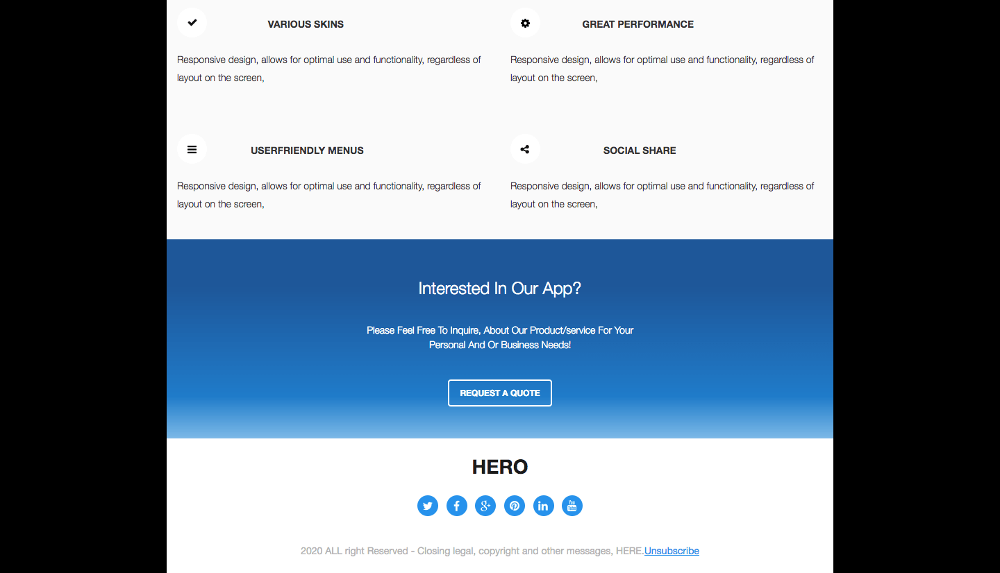
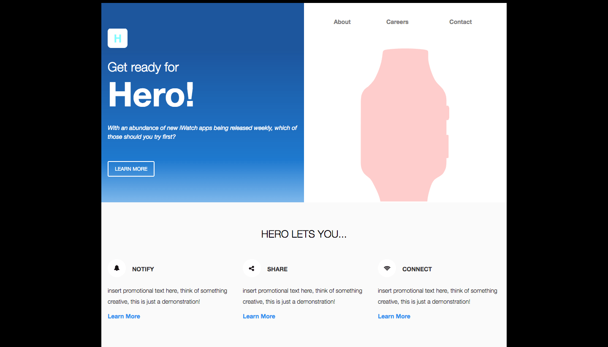

## HERO HTML EMAIL

This is a very simple static/responsive campaign e-mail. I used basic HTML/CSS to code it all together. I broke the images down via Adobe Photoshop as well, for more flexibility and customization.

## VIEW

To view, just clone the repository, and open it in your web browser of choice.